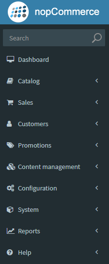
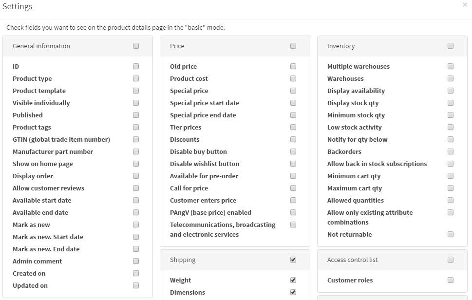

# nopCommerce Interface

This chapter covers the basics of nopCommerce interface.

The first screen that is displayed after logging in the nopCommerce administration area is a Dashboard.

The dashboard has following sections:

* **nopCommerce news** this is a section where important news, sales, and promotions information from nopCommerce are shown.

* Other sections show vital statistics of your webstore: **Common statistics, Orders, New customers, Order totals, Incomplete orders, Latest Orders, Popular search keywords, Bestsellers by quantity, Bestsellers by amount.** Learn more about them [here](xref:user-guide/running/reports/dashboard).

The dashboard sections are easily collapsed by clicking  item.

## Common nopCommerce page elements

### Sidebar

The sidebar is placed on the left of each page in the administration area. It allows you to navigate through nopCommerce administrator’s functionality.

The sidebar can be easily collapsed by clicking the “hamburger” icon next to the logo 

### Search field

On the top of the sidebar, there is a search field. Start typing a name of a section you want to navigate to, the search line auto-suggests the options, proceed directly to the required one.

### System menu

This part of the interface shows the name of a logged-in user, logout button, and a small menu from which a user can select to clear cache or restart application.

## Basic and Advanced models

On some pages in the administration area you will see the following switch:

This two-position Basic-Advanced switch allows you to switch between page display modes.

For the convenience of use, we made the “Basic” mode where the most frequent settings are shown.

If you cannot find a required setting on a page, switch to the “Advanced” mode to see all available settings.

On some pages, the switch has a **Settings** button beside. You can use it to set up the basic mode according to your needs by adding/removing the required settings.

Click **“Settings”** to see a list of the available settings. Tick the checkboxes of the **desired setting**. The added settings will then be displayed in the **Basic** mode.

